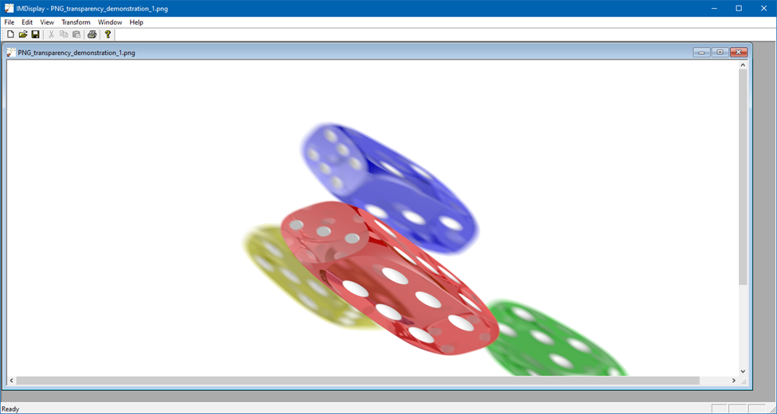

# 🪟 2      Windows

## 2.1         Практическое занятие. Изучение механизма управления доступом к объектам

#### Необходимое ПО и инструменты

Для проведения лабораторной работы на рабочей станции должно быть установлено ПО:

VMWare Workstation (или VMware Workstation Pro).

Для проведения лабораторной работы на рабочую станцию должна быть скопирована виртуальная машина Win10.

## Настройка окружения для работы

### **Настройка отладчика ядра Windows**

Для выполнения ряда заданий данной лабораторной работы предполагается использование отладчика ядра ОС Windows.

Для проведения отладки ядра необходимо выполнить следующие действия:

1\.       Указать в параметрах загрузки ядра использование режима локальной отладки. Для этого необходимо в командной оболочке, запущенной от имени администратора системы, выполнить команду **bcdedit –debug on**. После чего перезагрузить виртуальную машину.

2\.       Настроить WinDbg на загрузку символов ядра с сайта Microsoft. Для этого необходимо открыть ярлык WinDbg (x64) и в строке «Target» добавить к имени файла параметр запуска: **-y "srv\*c:\symbols\*https://msdl.microsoft.com/download/symbols"**, где c:\symbols – путь к локальному кэшу символов (можно использовать произвольный), а [https://msdl.microsoft.com/download/symbols](https://msdl.microsoft.com/download/symbols) - URL сервера символов Microsoft.

<figure><figcaption></figcaption></figure>

3\.       Запустить WinDbg и перейти в сеанс отладки локального ядра (File → Kernel debug, вкладка Local). **Примечание:** при первом запуске переход в режим отладки займет длительное время, так как фоном происходит загрузка символов ядра с сайта Microsoft. При последующих запусках переход в режим отладки будет происходить практически мгновенно.

4\.       В командной строке отладчика выполнить команду lml и убедиться, что успешно загружен модуль отладки ядра (nt) – вывод команды соответствует представленному на рисунке.

<figure><figcaption></figcaption></figure>

### **Запуск процессов от имени локальной системы**

Запуск процессов от имени локальной системы производится при помощи утилиты psexec из пакета sysinternals, при этом утилита должна запускаться с правами администратора.

Команда для запуска процесса с правами локальной системы имеет следующий вид: **psexec –s –i –d <команда с указанием полного пути>**. Опция –s предписывает произвести запуск от имени локальной системы, опция –i запускает процесс в интерактивном сеансе пользователя (что позволяет взаимодействовать с процессом), опция –d говорит утилите не ждать завершения запущенного процесса (чтобы получить обратно консоль, в которой производился запуск).

Запустите командную оболочку с правами локальной системы с помощью команды **psexec –s –i –d c:\windows\system32\cmd.exe**. После запуска командной оболочки проверьте, что она работает от имени учетной записи локальной системы с помощью команды **whoami** (см. рисунок).

<figure><figcaption></figcaption></figure>

## Изучение механизма управления доступом к объектам

### **Списки контроля доступа и права**

Списки контроля доступа (и отдельные их записи) используются диспетчером объектов и монитором ссылок (Security reference monitor – SRM) для определения возможного доступа субъекта к объекту. При этом в ядре ОС для каждого объекта формируется специальная структура, состоящая из заголовка (ACL) и записей (ACCESS\_ALLOWED\_ACE или ACCESS\_DENIED\_ACE). Ниже представлено объявление структур ACL, ACCESS\_ALLOWED\_ACE и ACCESS\_DENIED\_ACE из файла winnt.h.

```c
typedef struct _ACL {
  BYTE AclRevision;
  BYTE Sbz1;
  WORD AclSize;
  WORD AceCount;
  WORD Sbz2;
} ACL;
typedef struct _ACCESS_ALLOWED_ACE {
  ACE_HEADER  Header;
  ACCESS_MASK Mask;
  DWORD       SidStart;
} ACCESS_ALLOWED_ACE;
typedef struct _ACCESS_DENIED_ACE {
  ACE_HEADER  Header;
  ACCESS_MASK Mask;
  DWORD       SidStart;
} ACCESS_DENIED_ACE;
```


Вспомогательная структура ACE\_HEADER определяет тип ACE (как видно – обе структуры ACE фактически одинаковые), а также дополнительные флаги ACE (например, наследование).

Сами права в ACE представлены битовой маской, общая структура которой представлена на рисунке.

<figure><figcaption></figcaption></figure>

Для маски прав можно выделить 3 основных блока:

1\.       Общие права, используемые с самых ранних версий Windows NT (GR, GW, GE, GA)

2\.       Дополнительные права общие для всех типов объектов (Standard Access Rights)

3\.       Расширенные права, которые специфичны для типа объекта, к которому относятся права (файл, процесс, событие и пр.).

Биты в маске прав не являются независимыми (например, право Generic All подразумевает, что все остальные права также присутствуют). При этом приложения при доступе к объекту могут использовать произвольные блоки прав доступа в маске.

Для объектов, сохраняемых между сеансами пользователей (например, файлов и ключей реестра) предусматривается хранение информации об ACL вне памяти ядра. В случае файловой системы NTFS ACL хранятся в специальном файле $Secure, а в случае реестра – в самом двоичном файле реестра.

### **Просмотр списков контроля доступа в памяти ядра**

Запустите сеанс отладки ядра ОС Windows.

Выполните команду **!object \GLOBAL??\C:** для получения адреса заголовка объекта типа SymbolicLink (**Примечание:** указанная команда осуществляет поиск по всем объектам ядра, поэтому она выполняется достаточно длительное время), содержащего ссылку на физический том, которому назначен логический диск «C:». В выводе команды найдите адрес заголовка объекта (ObjectHeader), см. рисунок.

<figure><figcaption></figcaption></figure>

Выполните команду **dt nt!\_OBJECT\_HEADER <адрес>** для просмотра заголовка объекта символической ссылки диска C:. В выводе команды найдите адрес Security Descriptor (см. рисунок).

<figure><figcaption></figcaption></figure>

Абсолютный адрес дескриптора безопасности представлен в поле SecurityDescriptor без учета последних четырех бит (т.е. в значении поля необходимо занулить последний нимбл). Вывод содержимого SecurityDescriptor производится командой **!sd <адрес>** (см. рисунок).

<figure><figcaption></figcaption></figure>

В выводе ACL объекта найдите Well-known SID, соответствующий группе Everyone (все)

В командной оболочке выполните команду **set /P var=Input value > c:\out.txt**, после чего запустите утилиту Procexp64.exe из пакета sysinternals и найдите в ней соответствующий процесс cmd.exe. Включите отображение дескрипторов процесса (View → Lower Pan View → Handles). Найдите дескриптор файла c:\out.txt и откройте окно его свойств (см. рисунок).

<figure><figcaption></figcaption></figure>

Используйте адрес объекта (а также команды !object, dt и !sd) для просмотра SecurityDescriptor’а файла с помощью отладчика ядра:

1. Найдите адрес заголовка объекта, указав команду **!object <адрес объекта>**
2. Выведите содержимое заголовка объекта, используя команду **nt!\_OBJECT\_HEADER <адрес заголовка>**

В конечном счете вы должны получить примерно следующий вывод структуры заголовка объекта:

<figure><figcaption></figcaption></figure>

Значение null в поле SecurityDescriptor указывает, что логика работы с правами доступа к объекту вынесена за пределы диспетчера объектов (в данном случае в драйвер файловой системы – ntfs.sys).

### **Просмотр списков контроля доступа произвольных объектов**

Для просмотра списка контроля доступа произвольных объектов диспетчера объектов можно использовать модуль NtObjectManager для оболочки PowerShell.

Установка модуля NtObjectManager производится следующим образом:

1\.       Необходимо установить модуль по одному из путей, перечисленных в переменной PSModulePath

2\.       Проверить, что PowerShell корректно распознал модуль с помощью команды **Get-Module -ListAvailable**

3\.       Импортировать модуль с помощью команды Import-Module.

Запустите оболочку PowerShell. Вывести значение переменной PSModulePath можно с помощью команды **$Env:PSModulePath**. Скопируйте каталог NtObjectManager (расположен по пути C:\Utils) в один из каталогов, содержащихся в переменной PSModulePath. Рекомендуется использовать каталог C:Program Files\WindowsPowerShell\Modules, чтобы установленный модуль был доступен всем пользователям ОС.

Выполните команду **Get-Module -ListAvailable** и найдите в списке модуль NtObjectManager (см. Рисунок).

<figure><figcaption></figcaption></figure>

Выполните команду **Import-Module -name NtObjectManager.** Для проверки корректности загрузки модуля перейдите в корневой каталог объектов Диспетчера объектов с помощью команды **cd NtObject:\\**. Дополнительно можете вывести список объектов первого уровня с помощью команды **dir** (см. Рисунок).

<figure><figcaption></figcaption></figure>

Для вывода списка контроля доступа необходимо использовать стандартный командлет Get-Acl. В частности, для вывода списка контроля доступа к устройству CdRom0 необходимо выполнить команду: **Get-Acl \Device\CdRom0 | Format-List** (см. рисунок).

<figure><figcaption></figcaption></figure>

Наиболее полно информация представлена в строке SDDL (Secure Descriptor Definition Language), но для ее прочтения необходимо знать синтаксис SDDL или использовать стороннюю утилиту.

Запустите утилиту SDDLViewer (расположена на рабочем столе) и скопируйте в основное поле ввода строку с SDDL представлением ACL. В правой части окна утилиты выберите из выпадающего списка File and Directory Access Rights (это наиболее близкий из представленных в утилите список специальных прав объекта), после чего нажмите кнопку Make Report для получения проанализированного ACL (см. рисунок).

<figure><figcaption></figcaption></figure>

Приведите проанализированный ACL в отчете.

### **Применение ACL при управлении доступом к объектам**

#### **Порядок применения ACL и эффективные права доступа**

Проверка прав доступа по спискам контроля доступа производится только в момент создания дескриптора процессом (например, если речь о файловом объекте, то в момент вызова функции CreateFile).

При этом происходит проверка всех ACL назначенных объекту явно, а также унаследованных от вышестоящих объектов. ACL, запрещающие доступ (Deny ACL) применяются раньше ACL, разрешающих доступ (Allow ACL).

Проверка ведется до первого сработавшего ACL (отфильтрованного по SID и запрошенному доступу). Если это Deny ACL, то доступ запрещается, если Allow ACL – то разрешается. Если не подошел ни один ACL, то доступ также запрещается.

Для определения порядка применения ACL выполните:

1\.       Создайте папку C:\Workspace.

2\.       В этой папке создайте файл file.txt с произвольным содержимым.

3\.       Проверьте эффективные права доступа к каталогу Workspace для пользователя User1 для чего вызовите контекстное меню каталога (правой кнопкой мыши), выберите пункт «Properties», перейдите на вкладку «Security», нажмите кнопку «Advanced» и в открывшемся интерфейсе перейдите на вкладку Effective Access (см. рисунок).

<figure><figcaption></figcaption></figure>

<figure><figcaption></figcaption></figure>

4\.       Нажмите на ссылку «Select a user» для выбора пользователя, для которого будут отображены эффективные права доступа (User1), после чего нажмите кнопку «View effective access» (см. рисунок).

<figure><figcaption></figcaption></figure>

5\.       Проанализируйте вывод утилиты, а также списки контроля доступа каталога C:\Workspace

Обратите внимание, что у папки Workspace все ACL унаследованы от корневого каталога (C:\\). Отключите наследование ACL с помощью кнопки Disable Inheritance и выберите вариант «Remove all inherited permissions from this object».

Несмотря на то, что вы полностью удалили списки контроля доступа каталога, администратор по-прежнему может просматривать содержимое каталога или менять его списки контроля доступа. Это связано с тем, что администратор является владельцем каталога, а для владельца (на уровне кода ntfs.sys) зафиксирован определенный набор прав (в частности – просмотр и изменение ACL).

#### **Момент проверки ACL**

Проверка ACL в ОС Windows происходит в момент формирования дескриптора объекта для процесса его запросившего. Например, для объекта типа файл это происходит при вызове функции CreateFile (несмотря на свое название – эта функция предназначена для любого доступа к файлу, не только для создания).

Настройте для пользователя User1 полный доступ к файлу file.txt (проверьте доступ с помощью инструмента эффективных прав доступа).

Запустите командную оболочку от имени пользователя User1 (воспользуйтесь утилитой **psexec** или встроенной командой **RunAs**). Выполните в этой оболочке команду **pause >> file.txt**, нажмите любую клавишу, убедитесь, что в файле file.txt появилась строка «Press any key to continue . . .».

Повторно запустите указанную команду, но теперь до нажатия клавиши заблокируйте доступ пользователю User1 к файлу file.txt (проверьте, то доступ заблокирован с помощью инструмента эффективных прав доступа). Нажмите любую клавишу в консоли пользователя User1, убедитесь, что в файле file.txt появилась вторая строка «Press any key to continue . . .». Попробуйте запустить команду еще раз – убедитесь, что выводится ошибка доступа к файлу file.txt (см. рисунок).

<figure><figcaption></figcaption></figure>

Попробуйте повторить ту же операцию, используя для редактирования файла редактор notepad.exe. Убедитесь, что notepad не может производить запись в уже открытый файл после того, как пользователю User1 блокируется доступ к файлу.

Запустите утилиту procmon из пакета sysinternals. К существующему фильтру procmon добавьте строку, приведенную на рисунке.

<figure><figcaption></figcaption></figure>

Также для удобства добавьте фильтр «Operation is QueryDirectory then Exclude».

Проанализируйте работу команду **pause >> file.txt** и редактора notepad с файлом file.txt. Приведите в отчете объяснение, почему в случае с редактором notepad.exe не удается изменить уже открытый файл, к которому заблокирован доступ после его открытия.

Аналогичное поведение наблюдается и для других объектов, в том числе тех, доступ к которым управляется напрямую диспетчером объектов.

Запустите с помощью команды RunAs редактор notepad.exe от имени пользователя User1 и не закрывайте окно редактора.

Запустите утилиту procexp64 из пакета sysinternals. Откройте окно с отображением дескрипторов процессов (View → Lower pane view → Handles). Выберите любой процесс и найдите у него дескриптор объекта Desktop с именем \Default (см. рисунок)

<figure><figcaption></figcaption></figure>

С помощью отладчика ядра убедитесь, что у этого объекта присутствует ссылка на структуру SECURITY DESCRIPTOR и для него отображается список контроля доступа.

В окне свойств объекта утилиты Procexp64 перейдите на вкладку «Security» и добавьте запрещающий ACL для пользователя User1.

Убедитесь, что ранее запущенный редактор блокнот по-прежнему работает.

Попытайтесь запустить еще один экземпляр редактора блокнот от имени пользователя User1 – команда завершится с ошибкой.

<figure><figcaption></figcaption></figure>

Откройте теперь редактор прав файла, к которому у пользователя User1 нет доступа (например, все подкаталоги Workspace). Так как у пользователя нет прав доступа к объекту, то он не может видеть текущие списки контроля доступа, но при этом у пользователя User1 активна опция смены владельца (см. рисунок).

<figure><figcaption></figcaption></figure>

Смените владельца объекта на User1 и восстановите полный доступ к объекту.

## 2.2         Практическое занятие. Упаковка классического приложения в Universal Windows Platform

## Упаковка приложения ImageMagick в AppContainer (UWP)

Для упаковки ImageMagick в UWP будет использоваться [MSIX Packaging Tool](https://learn.microsoft.com/en-us/windows/msix/packaging-tool/tool-overview).

С помощью утилиты можно создать msix-пакет из уже существующего msi- или exe- установщика исходной программы.

Для упаковки был выбран вариант ImageMagick со статической линковкой зависимостей ([ImageMagick-7.1.0-52-Q8-x64-static.exe](https://imagemagick.org/archive/binaries/ImageMagick-7.1.0-52-Q8-x64-static.exe)).

#### Шаги создания пакета:

1\.       Выбрать пункт меню Application Package\


<figure><figcaption></figcaption></figure>

2\.       Выбрать “Create package on this computer”\


<figure><figcaption></figcaption></figure>

3\.       Выбрать установщик ImageMagick.

<figure><figcaption></figcaption></figure>

4\.       Задать параметры будущего MSIX-пакета. При переходе на следующий шаг автоматически начнется установка классического приложения ImageMagick.

5\.       Необходимо указать файл, который должен открываться при запуске пакета.\


<figure><figcaption></figcaption></figure>

6\.       Необходимо сохранить пакет\


<figure><figcaption></figcaption></figure>

## Проблемы, с которыми можно столкнуться при попытке установке пакета и их решения

### **Проблема 1:** Приложение не подписано

<figure><figcaption></figcaption></figure>

**Решение проблемы:** создать self-signed pfx сертификат по инструкции ([https://docs.microsoft.com/ru-ru/windows/msix/package/create-certificate-package-signing](https://docs.microsoft.com/ru-ru/windows/msix/package/create-certificate-package-signing)).  Затем подписать приложение с помощью MSIX Packaging Tool.

<figure><figcaption></figcaption></figure>

Теперь для установки приложения нужно добавить сертификат в доверенные сертификаты системы.

### **Проблема 2:** Не работает команда “magick”

**Решение проблемы:** Отредактировать файл манифеста пакета (AppxManifest.xml) с помощью программы упаковки.

<figure><figcaption></figcaption></figure>

В манифесте нужно добавить ссылку на пространство имен (тег “Package”) xmlns:uap5=[http://schemas.microsoft.com/appx/manifest/uap/windows10/5](http://schemas.microsoft.com/appx/manifest/uap/windows10/5)\
А так же добавить расширение с добавлением алиаса для командной строки:

_\<uap5:Extension Category="windows.appExecutionAlias" Executable="VFS\ProgramFilesX64\ImageMagick-7.0.10-Q16\magick.exe" EntryPoint="Windows.FullTrustApplication">_\
&#x20;         _\<uap5:AppExecutionAlias>_\
&#x20;           _\<uap5:ExecutionAlias Alias="magick.exe" />_\
&#x20;         _\</uap5:AppExecutionAlias>_\
&#x20;       _\</uap5:Extension>_

Executable – путь до исполняемого файла, к которому мы создаем алиас

EntryPoint – точка входа при вызове алиаса

Alias – алиас для запуска приложения в контейнере через командную строку

После этого пересобрать пакет.

## Проверки работоспособности пакета

### Проверка работоспособности приложения в графическом интерфейсе пользователя

1\.       В меню «Пуск» должен появиться пункт “ImageMagick Display”\


<figure><figcaption></figcaption></figure>

2\.       Необходимо произвести его запуск

3\.      Открыть файл изображения

<figure><figcaption></figcaption></figure>

<figure><figcaption></figcaption></figure>

4\.       Применить к нему трансформацию

<figure><figcaption></figcaption></figure>

5\.       Сохранить файл

<figure><figcaption></figcaption></figure>

6\.       Сохранение должно пройти успешно

<figure><figcaption></figcaption></figure>

### Проверка работоспособности приложения в консольном режиме

1\.       Необходимо произвести вывод программы по команде “magick”. Обнаружить справочную информацию\


<figure><figcaption></figcaption></figure>

2\.      Произвести конвертацию изображения PNG в JPG\


<figure><figcaption></figcaption></figure>

3\.       Изображение должно быть сохранено успешно\


<figure><figcaption></figcaption></figure>

### Проверка запуска приложения в контейнере

1\.       Для проверки возможно использовать приложение UWP TaskMonitor, доступное в магазине Windows.

2\.       После запуска ImageMagick и необходимо найти данный процесс его в списке. Тип приложения должен быть Packaged.

<figure><figcaption></figcaption></figure>

Данные приложение получает с помощью API Windows.System.Diagnostics.ProcessDiagnosticInfo ([https://blogs.windows.com/windowsdeveloper/2017/06/28/uwp-app-diagnostics/](https://blogs.windows.com/windowsdeveloper/2017/06/28/uwp-app-diagnostics/))

## 2.3         Практическое занятие. Настройка аутентификации по виртуальной смарт-карте. Политика целостности кода (Device Guard)

Открыть файл .vmx виртуальной машины Windows 10 и прописать следующий настройки для включения UEFI Secure Boot:\


```shell
firmware = "efi"
uefi.secureBoot.enabled = "TRUE"
uefi.allowAuthBypass = "TRUE"
```

Добавить TPM на виртуальную машину.

Создать теневую копию диска с помощью команд:

```powershell
 $s1 = (gwmi -List Win32_ShadowCopy).Create("C:\","ClientAccessible")
 $s2 = gwmi Win32_ShadowCopy | ? { $_.ID -eq $s1.ShadowID }
 $d  = $s2.DeviceObject + "\"
 cmd /c mklink /d C:\scpy "$d"
```

Отсканировать снимок диска и получить xml-файл с подписями и хэш-кодами неподписанных исполняемых файлов:

```powershell
New-CIPolicy -Level PcaCertificate -Fallback Hash -FilePath C:\BasePolicy.xml -ScanPath C:\scpy -UserPEs
```

### Тем временем... Windows Server 2016

### [Active Directory Certificate Services](#user-content-fn-1)[^1]

Произвести установку Active Directory

Выбрать [Tools -> Active Directory Users and Computers](#user-content-fn-2)[^2]

* Открыть вкладку домена и открыть Users
* Найти пользователя, с которого необходимо авторизоваться для получения сертификата
* Кликнуть правой кнопкой и выбрать Properties
* Выбрать вкладку Member Of
* Нажать кнопку Add… Добавить пользователя в группу IIS\_IUSRS

Далее выбрать [Manage -> Add Roles and Features](#user-content-fn-3)[^3]

При установке поставить отметки в полях:

* [Active Directory -> Certificate Enrollment Policy Web Server](#user-content-fn-4)[^4]
* [Active Directory -> Certificate Enrollment Web Server](#user-content-fn-5)[^5]

После установки рядом с кнопкой Manage[^6] кликнуть на флажок\
Выбрать configure [Active Directory Certificate Services](#user-content-fn-7)[^7]\
При выборе ролей выбрать:

* [Certificate Enrollment Policy Web Server](#user-content-fn-8)[^8]
* [Certificate Enrollment Web Server](#user-content-fn-9)[^9]

Указать CA, выбрав “CA name”\
Выбрать тип аутентификации User name and password \
Указать аккаунт, выбрав select и введя данные того пользователя, которого ранее добавили в группу IIS\_IUSRS\
Снова выбрать тип аутентификации User name and password\
Дождаться завершения конфигурации

### [Internet Information Services Manager](#user-content-fn-10)[^10]

* Открыть Server Manager
* Выбрать [Tools -> Internet Information Services Manager](#user-content-fn-11)[^11]
* Кликнуть на домен
* Кликнуть на Sites&#x20;
* Кликнуть на Default Web Site
* Выбрать часть, которая содержит подстроку “ADPolicyProvider\_CEP“
* В центральном окне выбрать [Application Settings](#user-content-fn-12)[^12]&#x20;
* Указать FriendlyName
* Скопировать адрес URI и сохранить его где-то для дальнейшего использования

Перезапустить сервер

* Открыть Server Manager
* Выбрать [Tools -> Internet Information Services Manager](#user-content-fn-13)[^13]
* Кликнуть на домен
* Кликнуть на Sites
* Кликнуть на Default Web Site
* Выбрать Bindings...[^14] -> https -> Edit... -> Выбрать промежуточный SSL-сертификат

### [Group Policy Management](#user-content-fn-15)[^15]

* Открыть Server Manager
* Выбрать [Tools -> Group Policy Management](#user-content-fn-16)[^16]
* Открыть [Forest:Domain.com -> Domains -> DOMAIN.com ](#user-content-fn-17)[^17]
* Правой кнопкой кликнуть по DOMAIN.local и выбрать \
  [“Create a GPO in this domain, and link it here”](#user-content-fn-18)[^18]
* В поле Name ввести имя объекта групповой политики
* Нажать ОК
* Кликнуть по только что созданному объекту
* При выводе ошибки кликнуть ОК
* Кликнуть правой кнопкой мыши по новому созданному объекту и выбрать Edit...
* Открыть \
  [User Configuration -> Policies -> Windows Settings -> Security Settings -> Public Key Policy](#user-content-fn-19)[^19]
* Дважды кликнуть по \
  [Certificate Services Client - Certificate Enrollment Policy](#user-content-fn-20)[^20]
* Включить модель
* Нажать кнопку Add…&#x20;
* В поле URI вставить тот URI, который запомнили ранее
* В поле [Autentication type](#user-content-fn-21)[^21] выбрать тип Username/password&#x20;
* Нажать кнопку Validate Server
* Ввести данные пользователя
* Дождаться прохождения валидации. Нажать Add

### Создание шаблона Smartcard

Открыть консоль управления (запустить mmс) в режиме администратора&#x20;

Выбрать вкладку [File -> Add/Remove Snap-in](#user-content-fn-22)[^22]&#x20;

Выбрать в списке [Certificate Templates](#user-content-fn-23)[^23] и [Certification Authority](#user-content-fn-24)[^24], нажать Add

При запросе выбрать Local Computer. Нажать ОК

На левой панели дважды кликнуть по [Certificate Templates](#user-content-fn-25)[^25]

Найти в списке Smartcard Logon, \
кликнуть по ней правой кнопкой мыши и выбрать Duplicate Template

Откроются свойства нового шаблона

Во вкладке Compatibility[^26] установить [Certification authority](#user-content-fn-27)[^27] и [Certificate recipient](#user-content-fn-28)[^28]\
Во вкладке General указать имя шаблона\
Во вкладке [Request Handling](#user-content-fn-29)[^29] установить Purpose в состояние [Signature and smartcard login](#user-content-fn-30)[^30] и выбрать [Prompt the user during enrollment](#user-content-fn-31)[^31] \
Во вкладке Cryptography установить минимальный размер ключа 2048 и кликнуть по [Requests must use one of the following providers](#user-content-fn-32)[^32], выбрав \
`Microsoft Base Smart Card Crypto Provider`\
Во вкладке Security добавить группу пользователей (например, [Authenticated Users](#user-content-fn-33)[^33]) для регистрации, указав им разрешение на регистрацию. [Allow -> Enroll](#user-content-fn-34)[^34]\
Нажать ОК

В левой панели найти [Certificate Templates](#user-content-fn-35)[^35] \
кликнуть правой клавишей -> New -> [Certificate Template to Issue](#user-content-fn-36)[^36]

Выбрать шаблон, который был создан. Нажать ОК

В левой панели кликнуть правой кнопкой мыши по имени CA и нажать -> All tasks  -> Stop Service и аналогично Start Service для перезапуска сервиса

### Windows 10

### Device Guard Part

Полученный XML-файл необходимо скомпилировать в бинарный формат и поместить в системную папку **C:\Windows\System32\CodeIntegrity\\**

```powershell
ConvertFrom-CIPolicy C:\BasePolicy.xml C:\SIPolicy.bin 
cp C:\SIPolicy.bin c:\Windows\System32\CodeIntegrity\SIPolicy.p7b 
```

После перезагрузки компьютера механизм Code Integrity начнет работу в режиме аудита. Проверив запуск и работу всех необходимых программ, можно дополнить политику данными, собранными аудитом, выполнив следующую команду

```powershell
New-CIPolicy -Level PcaCertificate -Fallback Hash C:\AuditPolicy.xml -Audit
```

Ключ _-Audit_ указывает, что необходимо создать политику на основе записей в журнале аудита.\
Файл AuditPolicy.xml аналогичен по структуре файлу BasePolicy.xml, сформированному ранее.\
Для объединения результатов первичного сканирования и собранной в режиме аудита информации существует команда объединения политик

```powershell
Merge-CIPolicy –OutputFilePath C:\Final.xml –PolicyPaths C:\ BasePolicy.xml,C:\AuditPolicy.xml
```

Чтобы включить принудительное применение политики, в полученном файле отключаем режим аудита

```powershell
Set-RuleOption -Option 3 -FilePath C:\Final.xml -Delete
```

В результате удаляется запись _Enabled:Audit Mode_ из XML-файла, и такая политика будет блокировать всё неучтенное в ней ПО.\
Далее компилируем XML-файл в бинарный формат, снова выполнив команду

```powershell
ConvertFrom-CIPolicy C:\Final.xml C:\SIPolicy.bin
```

Распространить политику на целевые компьютеры можно как скопировав удобным способом файл **SIPolicy.bin**, так и воспользовавшись групповой политикой Windows 10 в разделе **Computer Configuration\Administrative Templates\System\Device Guard**

### SmartCard part

У адаптера в свойствах IPv4 указать в поле адрес DNS сервера адрес Windows Server 2016

Открыть панель управления. \
Выбрать System and Security -> System\
В части настроек рабочей группы нажать “Change settings”\
Для изменения домена кликнуть на Change\
Выбрать домен DOMAIN.local\
Ввести данные пользователя\
Дождаться перезагрузки системы

Открыть редактор локальной групповой политики (Например с помощью win+r -> gpedit.msc)\
Перейти в Computer Configuration -> Administrative Templates -> System ->Device Guard\
Дважды кликнуть по [Turn On Virtualization Based Security](#user-content-fn-37)[^37]\
Установить политику, выбрав Enabled\
Установить Credential Guard Configuration в значение Enabled with UEFI lock\
Сохранить изменения, нажав OK


В старых версиях Windows открыть Программы и компоненты (Например с помощью win+r -> appwiz.cpl) \
В левой панели найти Turn Windows features on or off. Найти Isolated User Mode и поставить напротив него галочку. Нажать OK. Перезагрузить машину


Открыть управление модулем TPM (Например с помощью win+r -> tpm.msc)\
Убедиться, что его статус “ready for use”\
Если это не так, то в правой части нажать Prepare the TPM, перезагрузить машину и при перезагрузке подтвердить инициализацию модуля TPM

Открыть командную строку в режиме администратора.\
Ввести команду

```powershell
tpmvscmgr.exe create /name mycard /pin PROMPT /adminkey DEFAULT /puk PROMPT /generate
```

Ввести PIN, подтвердить\
Ввести PUK, подтвердить\
При этом Admin key будет таким\
`010203040506070801020304050607080102030405060708`\
Дождаться создания виртуальной смарт карты\
Проверить, что она создалась, с помощью команды

<pre class="language-powershell"><code class="lang-powershell"><strong>wmic path win32_PnPEntity where “DeviceID like ‘%smartcardreader%’” get DeviceID,Name,Status
</strong></code></pre>

Открыть консоль сертификатов(например с помощью win+r -> certmgr.msc)\
Выбрать Active Directory Enrollment Policy\
В списке шаблонов выбрать шаблон для смарт карты\
Нажать Enroll\
Ввести PIN\
Дождаться завершения регистрации и нажать Finish

Открыть локальные политики безопасности (Например с помощью win+r -> secpol.msc)


Или групповые политики домена (gpmc.msc) на сервере


Перейти в Security Settings -> Local Policies -> Security Options\
Найти Interactive logon: Require smart card и дважды кликнуть\
Выбрать Enabled\
Перезапустить машину, теперь вход в учётную запись может производиться только по смарт карте

[^1]: Службы сертификатов Active Directory

[^2]: Средства -> Пользователи и компьютеры Active Directory

[^3]: Управление -> Добавить роли и компоненты

[^4]: Службы сертификатов Active Directory -> Веб-служба политик регистрации сертификатов

[^5]: Службы сертификатов Active Directory -> Веб-служба регистрации сертификатов

[^6]: Управление

[^7]: Службы сертификатов Active Directory

[^8]: Веб-служба политик регистрации сертификатов

[^9]: Веб-служба регистрации сертификатов

[^10]: Диспетчер служб IIS

[^11]: Управление -> Диспетчер служб IIS

[^12]: Параметры приложения

[^13]: Управление -> Диспетчер служб IIS

[^14]: Привязки...

[^15]: Управление групповой политикой

[^16]: Управление ->  Управление групповой политикой

[^17]: Лес:домен.com -> Домены -> домен.com

[^18]: "Создать объект групповой политики в этом домене и связать его..."

[^19]: Конфигурация пользователя -> Политики -> Конфигурация Windows -> Параметры безопасности -> Политики открытого ключа

[^20]: Клиент служб сертификации: политика  регистрации сертификатов

[^21]: Тип проверки подлинности

[^22]: Файл -> Добавить или удалить оснастку...

[^23]: Шаблоны сертификатов

[^24]: Центр сертификации

[^25]: Шаблоны сертификатов

[^26]: Совместимость

[^27]: Центр сертификации

[^28]: Получатель сертификата

[^29]: Обработка запроса

[^30]: Вход с подписью и смарт-картой

[^31]: Запрашивать пользователя во время регистрации

[^32]: В запросах могут использоваться только следующие поставщик

[^33]: Прошедшие проверку

[^34]: Разрешить -> Заявка

[^35]: Шаблоны сертификатов

[^36]: Выдаваемый шаблон сертификата

[^37]: Включить средство обеспечения безопасности на основе виртуализации
