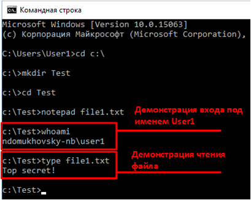

# 🦉 4       Самостоятельная работа (Windows)

**Deadline **<mark style="color:red;">**00:00**</mark>**:00 **<mark style="color:red;">**01.01**</mark>**.2023**

## Требования к выполнению отчетного задания по курсу «Защита операционных систем»

Отчетное задание подразумевает выполнение ряда действий в виртуальной среде, при этом разработка порядка действий является частью задания.

Максимальный балл может принимать значение:

* 60 – самые простые задания, баллы соответствуют оценке «удовлетворительно»;
* 80 – задания средней сложности, баллы соответствуют оценке «хорошо»;
* &#x20;100 – задания повышенной сложности, баллы соответствуют оценке «отлично».

Отчет по выполнению задания состоит из следующих частей:

1\.       Описание выполненных настроек. Описание настроек должно позволять повторить выполненные действия по настройке виртуального стенда. Для описания настроек рекомендуется использовать форму, приведенную ниже

| Наименование виртуальной машины                                                                                                                       | Где выполняется настройка                                                                                                                                                                                                                   | Способ выполнения настройки                                                                                                                                                                                                                                                            | Данные для выполнения настройки                                                                                                                                                                                               |
| ----------------------------------------------------------------------------------------------------------------------------------------------------- | ------------------------------------------------------------------------------------------------------------------------------------------------------------------------------------------------------------------------------------------- | -------------------------------------------------------------------------------------------------------------------------------------------------------------------------------------------------------------------------------------------------------------------------------------- | ----------------------------------------------------------------------------------------------------------------------------------------------------------------------------------------------------------------------------- |
| 
<em>Если виртуальный стенд состоит из нескольких машин, то обязательно указать на какой ВМ выполняется действие.</em>

Пример:

VM-1
 | 
<em>Указать компонент ОС/программное обеспечение, настройка которого выполняется (локальная политика безопасности, политика встроенного МЭ, файл /etc/passwd и пр.)</em>

 

<strong>Пример:</strong>

Реестр windows
 | 
<em>Описать порядок действий по настройке. Упор именно на действия, все данные рекомендуется выносить в соседний столбец.</em>

 

<strong>Пример:</strong>

Запустить в проводнике файл settings.reg, в появившемся окне подтвердить добавление данных в реестр
 | Данные, используемые для соответствующей настройки. Допустимо вложение конкретных файлов, в том числе, в специализированных форматах компонента, с помощью которого выполняется настройка (например, файл групповой политики) |

&#x20;

2\.       Описание проверок, которые позволяют убедиться, что задание выполнено. Например, если задачей была настройка конкретной матрицы доступа, то проверки должны включать различные попытки доступа, проверяющие элементы матрицы. Ниже представлен пример описания проверки.

| Описание проверки                                                                      | Ожидаемый результат           |
| -------------------------------------------------------------------------------------- | ----------------------------- |
| Войти в систему по учетной записью User1 и попытаться открыть на чтение файл file1.txt | Файл успешно открыт на чтение |

&#x20;

3\.       Результат выполнения проверки в виде протокола последовательного выполнения проверок из п. 2. Каждое выполнение проверки должно сопровождаться свидетельством выполнения (например, снимком экрана). Ниже приведен пример оформления (элементы снимка экрана выделены также в качестве примера)

| Проверка                                                                               | Результат | Свидетельство                |
| -------------------------------------------------------------------------------------- | --------- | ---------------------------- |
| Войти в систему по учетной записью User1 и попытаться открыть на чтение файл file1.txt | Успешно   |  |

&#x20;

## 4.1         Использование привилегий ОС Windows для обхода дискреционной модели разграничения доступа ОС Windows

### 4.1.1        Подготовка к работе

Учитывая потенциальную возможность компрометации ОС через механизм привилегий, в ОС Windows предусмотрено ограничение на доступные неадминистративному пользователю привилегии посредством механизма User Access Control (UAC). Механизм UAC фильтрует доступные привилегии для неадминистративной учетной записи, соответственно, попытки обхода механизмов безопасности буду сводится к повышению привилегий учетной записи до административной

Для того, чтобы посмотреть на влияние именно привилегий на механизмы безопасности, для выполнения этого задания **механизм UAC нужно отключить**

Кроме того, вам потребуется подготовить файл с ограниченным доступом, к которому неадминистративный пользователь будет пытаться получить доступ

1. Отключите механизм UAC в ОС Windows
2. Создайте папку **Data** и в ней файл **secret.txt** с произвольным содержимым
3. Создайте пользователя (например, User2), который будет являться членом только встроенной группы «Пользователи»
4. На папке Data настройте ACL, запрещающий весь доступ пользователю User2 (с распространением ACL на все содержимое папки)
5. Убедитесь, что пользователь User2 не может получить доступ к содержимому файла secret.txt

### 4.1.2        Обход ACL с помощью привилегии SeTakeOwnershipPrivilege


Примечание: информация о назначении привилегий пользователям доступна по ссылке:




1\.       Предоставьте пользователю User2 привилегию SeTakeOwnershipPrivilege

2\.       Получите доступ к содержимому файла secret.txt от имени пользователя User2

### 4.1.3        Обход ACL с помощью привилегий SeBackupPrivilege и SeRestorePrivilege

1\.       Предоставьте пользователю User2 привилегии SeBackupPrivilege и SeRestorePrivilege

2\.       Получите доступ к содержимому файла secret.txt от имени пользователя User2

### 4.1.4        Обход ACL с помощью привилегий SeManageVolumePrivilege\*

1\.       Предоставьте пользователю User2 привилегии SeManageVolumePrivilege

2\.       Получите доступ к содержимому файла secret.txt от имени пользователя User2

### 4.1.5        Обход ACL с помощью привилегий SeTcbPrivilege\*

1\.       Предоставьте пользователю User2 привилегии SeTcbPrivilege

2\.       Получите доступ к содержимому файла secret.txt от имени пользователя User2

## 4.2         Работа с UAC

### 4.2.1 Подготовка к работе

Верните настройку UAC в исходное состояние

<figure><figcaption></figcaption></figure>

### 4.2.2        Контроль срабатывания UAC при запуске программ

1\.       Настройте возможность запуска утилиты regedit без запроса повышения привилегий пользователя. Убедитесь, что в этом случае regedit не позволяет вносить правки в разделы, доступ к которым возможен только от имени администратора

2\.       Настройте запуск программы, для которой срабатывает эвристика запроса повышения привилегий, без сработки UAC (например, установочный пакет Unity 3D)

## 4.3          Секретный каталог


Примечание: для манипуляции метками безопасности Mandatory Integrity Control (MIC) можно использовать утилиту chml, доступную по ссылке




1. Создайте каталог для хранения секретных документов (например, Secret)
2. С помощью механизма MIC настройте политики контроля целостности так, чтобы:
   * Пользователи могли работать с файлами в каталоге Secret с помощью редактора Блокнот
   * Пользователи не могли копировать другие файлы в каталог/из каталога
   * Пользователи не могли сохранять файлы, открытые в Блокноте в других каталогах
